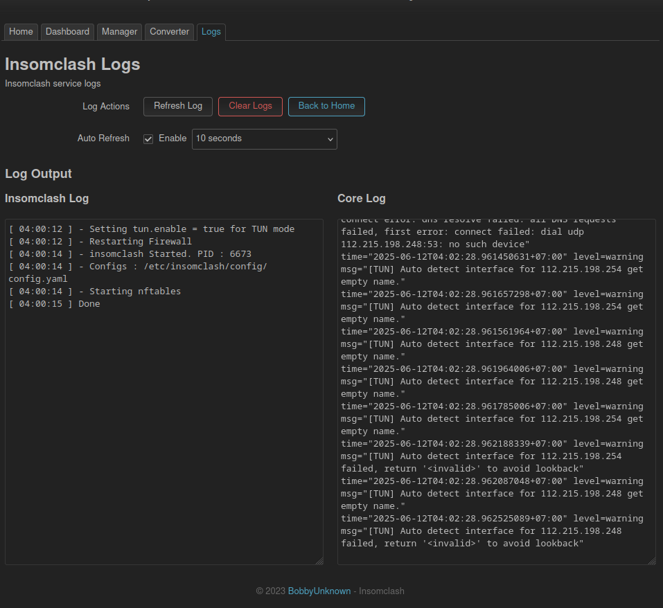

## Luci app insomclash for openwrt

[](https://github.com/bobbyunknown/luci-app-insomclash/releases)
[](https://github.com/bobbyunknown/luci-app-insomclash)

#### Support me:
[](https://sociabuzz.com/bobbyunknown/tribe)
[](https://saweria.co/widgets/qr?streamKey=48ea6792454c7732924b663381c69521)

#### Telegram group:
[](https://t.me/+TuLCASzJrVJmNzM1)

### Features
- Mihomo core
- Tproxy
- Yacd panel
- Filemanager, edit config, proxy, dan upload

### Installation

#### Manual Method
- Download installation package from [Release](https://github.com/bobbyunknown/luci-app-insomclash/releases)
#### Auto Install Method
- Run the following command in terminal:
```bash
bash -c "$(curl -fsSL https://raw.githubusercontent.com/bobbyunknown/luci-app-insomclash/main/install.sh)"
```
### Core and Geofiles

#### Core

**For (x86_64):**
- mihomo-linux-amd64
- mihomo-linux-amd64-compatible
- mihomo-linux-amd64-compatible
- mihomo-linux-amd64-compatible

**For ARM:**
- mihomo-linux-arm64
- mihomo-linux-armv7
- mihomo-linux-armv5

> ⚠️ **Important**: Choose the core that matches your device's CPU architecture for optimal performance

### How to Install Core & Geodata
1. Download the appropriate
2. Extract the `.gz` file
3. Rename to `mihomo`
4. Upload to directory `/etc/insomclash/core`
5. Upload all geodata to `/etc/insomclash/run`

### Geo Database 
| File | Description | Size |
|------|------------|------|
| `country.mmdb` | Complete MaxMind database | Large |
| `country-lite.mmdb` | Compact MaxMind database | Small |
| `geoip.dat` | Complete GeoIP DAT format | Large |
| `geoip-lite.dat` | Compact GeoIP DAT format | Small |
| `geoip-lite.db` | Optimized GeoIP DB format | Small |
| `geoip-lite.metadb` | GeoIP Metadata | Minimal |

> 💡 **Tips**: Use "lite" versions to save storage while maintaining core functionality

For complete guide on using GEOSITE and GEOIP, please visit [official documentation](https://github.com/bobbyunknown/luci-app-insomclash/blob/main/README-DAT.md)

#### Auto install geofiles and core
- Run the following command in terminal:
```bash
bash -c "$(curl -fsSL https://raw.githubusercontent.com/bobbyunknown/luci-app-insomclash/main/install-core-geofiles.sh)"
```

### Directory Locations
| Type | Path |
|------|------|
| Run | `/etc/insomclash/run` |
| Core | `/etc/insomclash/core` |
| Config | `/etc/insomclash/profile` |
| Proxy | `/etc/insomclash/proxy` |
| Rule | `/etc/insomclash/rule` |
| GeoFile | `/etc/insomclash/` |

### Rule and Proxy Configuration Tutorial

#### How to Configure
1. Edit example config file in filemanager tab and adjust the following sections:
   - `proxy-providers`: List of proxy providers
   - `proxy-groups`: Proxy group settings
   - `rule-providers`: List of rule providers
   - `rules`: Routing rules

#### External File Placement
If you want to use rule and proxy files separate from main config:
- Proxy files: Upload to `/etc/insomclash/proxy`
- Rule files: Upload to `/etc/insomclash/rule`
- Or upload in insomclash file manager tab then select proxy rule tab

#### Example Config Structure
```yaml
mode: rule
ipv6: false
log-level: silent
allow-lan: false
tproxy-port: 7894
unified-delay: true
tcp-concurrent: true
keep-alive-interval: 15
tcp-keep-alive-interval: 15
geodata-mode: true
geodata-loader: memconservative
external-controller: 0.0.0.0:9090
external-ui: ui

dns:
  enable: true
  listen: 0.0.0.0:7874
  ipv6: false
  default-nameserver: 
    - '1.1.1.1'
    - '1.0.0.1'
    - '8.8.8.8'
    - '8.8.4.4'
  nameserver: 
    - 'https://cloudflare-dns.com/dns-query'
    - 'https://dns.google/dns-query'

profile:
  store-selected: true
  store-fake-ip: true
  tracing: false

sniffer:
  enable: true
  sniff:
    HTTP:
      ports: [80, 8080-8880]
      override-destination: true
    TLS:
      ports: [443, 8443]
  skip-domain:
    - '+.microsoft.com'
    - '+.windows.com'
```

> 💡 **Tips**: 
> - Ensure provider URLs and file paths are correct
> - Adjust update intervals as needed
> - Use RULE-SET to better organize rules

### Screenshots

<details>
<summary>File Manager</summary>


</details>

<details>
<summary>Log</summary>


</details>

<details>
<summary>Start</summary>


</details>

<details>
<summary>Stop</summary>


</details>

### Credits
Thanks to:
- Allah SWT
- DBAI
- IndoWRT
- [MetaCubeX](https://github.com/MetaCubeX) for Core
- [ZeroLab](https://github.com/zerolabnet/SSClash) for Routing
- [RTA Server](https://github.com/rtaserver) for dat files


